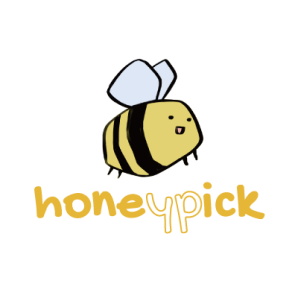
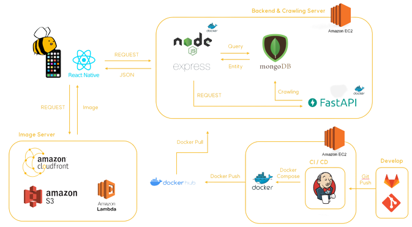

# 🐝 허니픽(honeypick)

## 🍯 서비스 소개

### 프로젝트 기간

2022.04.11 ~ 2022.05.20 (총 6주)

---

## 👑 서비스 아키텍처

## 📚 기술 스택

### Backend

  

### Frontend

  

### Database

 

### Deployment

  

### 이슈 관리

 

### 형상 관리

 

### 커뮤니케이션

  

## 🍒 핵심 기능

1. 위시/추천템 공유 및 추천
2. 다른 사용자들의 의견을 받아볼 수 있는 투표

## 🎨 UI 컨셉

## 팀원 소개

| [김민채](https://github.com/minchae9)       | [이효림](https://github.com/hyorimlee)      | [최재진](https://github.com/svstar94)       |
| ---------------------------------------- | ---------------------------------------- | ---------------------------------------- |
|  |  |  |
| 팀장, Backend                              | Backend                                  | Backend                                  |
| PM(Jira, Wiki 관리) API 문서 작성 및 구현 인프라 보조 UCC 기획 |   인프라 구축 BE 개발(User, Profile, Search) API 문서 작성 UCC기획 및 제작                   | API 문서 작성 FE, BE 개발 이미지 관리 크롤러 개발 |

| [이언호](https://github.com/unho-00)        | [최현규](https://github.com/%7B%7D)         | [한지윤](https://github.com/yoonnotyoun)    |
| ---------------------------------------- | ---------------------------------------- | ---------------------------------------- |
|  |  |  |
| Frontend                                 | Frontend                                 | Frontend                                 |
| FE 개발 (공통 컴포넌트 생성, 로그인/회원가입 페이지, 프로필 페이지, 팔로우 페이지, 기타 버그 수정) |                                          |                                          |
