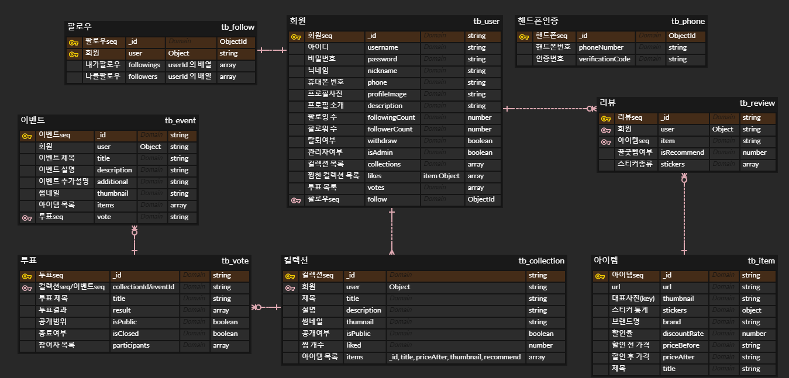

# Backend

## 👕ERD




## 🎈API 명세

|  번호  |  카테고리  |                    기능                    |                 URI                 |  PARAMS   |  METHOD  |
| :--: | :----: | :--------------------------------------: | :---------------------------------: | :-------: | :------: |
|  -   |   회원   |  <code>api/v1<mark>/auth</mark></code>   |                                     |           |          |
|  1   |        |                  회원 가입                   |        <code>/signup</code>         |           |  `POST`  |
|  2   |        |                  자체 로그인                  |         <code>/login</code>         |           |  `POST`  |
|  3   |        |                  토큰 재발급                  |        <code>/refresh</code>        |           |  `POST`  |
|  4   |        |                  회원 탈퇴                   |           <code>/</code>            |           | `DELETE` |
|  -   | 휴대폰 인증 |  <code>api/v1<mark>/phone</mark></code>  |                                     |           |          |
|  5   |        |               휴대폰 인증번호 발송                |           <code>/</code>            |           |  `POST`  |
|  6   |        |               휴대폰 인증번호 검증                |         <code>/check</code>         |           |  `POST`  |
|  -   |  프로필   | <code>api/v1<mark>/profile</mark></code> |                                     |           |          |
|  7   |        |                  프로필 조회                  |        <code>/:userId</code>        |           |  `GET`   |
|  8   |        |                  프로필 수정                  |           <code>/</code>            |           | `PATCH`  |
|  9   |        |                 비밀번호 변경                  |       <code>/password</code>        |           | `PATCH`  |
|  -   |  팔로잉   | <code>api/v1<mark>/follow</mark></code>  |                                     |           |          |
|  10  |        |                팔로우/팔로우 취소                |           <code>/</code>            |           |  `POST`  |
|  11  |        |                팔로잉 목록 조회                 |  <code>/:userId/followings</code>   |           |  `GET`   |
|  12  |        |                팔로워 목록 조회                 |   <code>/:userId/followers</code>   |           |  `GET`   |
|  -   |  컬렉션   | <code>api/v1<mark>/collection</mark></code> |                                     |           |          |
|  13  |        |                  컬렉션 생성                  |           <code>/</code>            |           |  `POST`  |
|  14  |        |                컬렉션 목록 조회                 |        <code>/:userId</code>        |           |  `GET`   |
|  15  |        |                컬렉션 상세 조회                 | <code>/:userId/:collectionId</code> |           |  `GET`   |
|  16  |        |                  컬렉션 수정                  | <code>/:userId/:collectionId</code> |           | `PATCH`  |
|  17  |        |                  컬렉션 삭제                  | <code>/:userId/:collectionId</code> |           | `DELETE` |
|  -   | 컬렉션 찜  |  <code>api/v1<mark>/like</mark></code>   |                                     |           |          |
|  18  |        |               컬렉션 찜 설정/해제                |           <code>/</code>            |           |  `POST`  |
|  19  |        |               컬렉션 찜 목록 조회                |           <code>/</code>            |           |  `GET`   |
|  -   |   투표   |  <code>api/v1<mark>/vote</mark></code>   |                                     |           |          |
|  20  |        |                  투표 생성                   |           <code>/</code>            |           |  `POST`  |
|  21  |        |                 투표 목록 조회                 |           <code>/</code>            | accountId |  `GET`   |
|  22  |        |                 투표 상세 조회                 |        <code>/:voteId</code>        | accountId |  `GET`   |
|  23  |        |                  투표 종료                   |        <code>/:voteId</code>        |           | `PATCH`  |
|  24  |        |                  투표 삭제                   |        <code>/:voteId</code>        |           | `DELETE` |
|  25  |        |                  투표권 행사                  |    <code>/:voteId/:itemId</code>    |           | `PATCH`  |
|  -   |   검색   | <code>api/v1<mark>/search</mark></code>  |                                     |           |          |
|  26  |        |               아이템, 컬렉션 검색                |           <code>/</code>            |   type    |  `POST`  |
|  -   |  아이템   |  <code>api/v1<mark>/item</mark></code>   |                                     |           |          |
|  27  |        |                  아이템 등록                  |           <code>/</code>            |           |  `POST`  |
|  28  |        |                아이템 상세 조회                 |        <code>/:itemId</code>        |  userId   |  `GET`   |
|  29  |        |                  아이템 추가                  |        <code>/:itemId</code>        |           | `PATCH`  |
|  -   | 아이템 리뷰 | <code>api/v1<mark>/item/:itemId</mark></code> |                                     |           |          |
|  30  |        |                  리뷰 생성                   |        <code>/review</code>         |           |  `POST`  |
|  31  |        |                  리뷰 수정                   |   <code>/review/:reviewId</code>    |           | `PATCH`  |
|  -   |   추천   | <code>api/v1<mark>/recommend</mark></code> |                                     |           |          |
|  32  |        |                  컬렉션 추천                  |        <code>/:userId</code>        |           |  `GET`   |
|  -   |  이벤트   |  <code>api/v1<mark>/event</mark></code>  |                                     |           |          |
|  33  |        |                  이벤트 생성                  |           <code>/</code>            |           |  `POST`  |
|  34  |        |                이벤트 목록 조회                 |           <code>/</code>            |           |  `GET`   |
|  35  |        |                이벤트 상세 조회                 |       <code>/:eventId</code>        |           |  `GET`   |
|  36  |        |                  이벤트 수정                  |       <code>/:eventId</code>        |           | `PATCH`  |
|  37  |        |                  이벤트 삭제                  |       <code>/:eventId</code>        |           | `DELETE` |


## 🎨CI/CD


## 기술 특이점


### MongoDB


백엔드 DB는 NoSQL인 몽고디비를 사용해 개발을 진행하였습니다.

프론트에서 사용한 React Native는 JSON 형식으로 데이터를 주고받고, 몽고디비는 JSON(BSON) 형식으로 데이터를 관리합니다.\
따라서, 중간에 데이터를 변환하거나 ORM을 사용할 필요가 없습니다.

서버를 Express.js를 사용해 Non-blocking I/O를 가장 효과적으로 적용할 수 있는 DB로써 몽고DB를 사용했습니다.\
ms단위에서 동시에 doc 수정이 발생했을 때 ACID를 보장하지 않지만, 차단상태를 최소화함으로써 사용자의 앱 사용경험을 극대화하였습니다.

SNS 앱 특성상 DB에 데이터를 생성, 수정, 삭제하는것보다, 읽는 비중이 월등이 컸습니다.\
따라서 CUD보다 R의 퍼포먼스가 중요했고, 몽고DB는 이를 효과적으로 수행했습니다.

<br><br>

### Search


사용자가 테스트 이후 본인만의 이미지를 제작하였을때, 이미지 파일을 저장하기 위한 저장소로 Firebase Storage 를 활용하였습니다.\
Firebase Storage 에 저장된 이미지 url 을 자체 서버 DB(mySQL)에 기록하여 저희 서비스 서버의 부하를 줄이는 방식으로 관리하였습니다.

이전 사용자들의 이미지를 다운로드 혹은 조회를 위해서는 DB에 저장된 url 을 이용하여 다운로드 및 조회 서비스를 제공하였습니다.

<br><br>

### Image Management (AWS)


이미지는 아마존 클라우드 환경을 활용해 개발을 진행했습니다.

서버리스 제품 중 이미지를 저장할 S3, 이미지를 변환해줄 lambda, 이미지 캐싱, 읽는데 cloudfront를 활용하였습니다.

많은 상품 데이터를 크롤링하는 만큼, 백엔드에 상당히 많은 이미지가 저장되게 됩니다.\
이를 서버에 저장하기보다 스토리지의 확장성을 고려해 S3 버킷에 이미지 파일을 저장하였습니다.

앱에서 필요 이상 사이즈의 이미지 데이터를 동시에 여러개 호출하게 되면, 렉이 발생할 수 있습니다.\
따라서, AWS Lambda를 활용해 필요한 이미지 사이즈 별로 원본을 Resizing하여 저장했습니다.\
이를 통해 이미지를 효율적으로 관리하며, 사용자 경험을 향상시켰습니다.

CloudFront는 콘텐츠 전송 네트워크(CDN) 서비스입니다.\
기존 S3만 사용했을때에는 오리진 서버에서 사용자에게 데이터를 전송하기 때문에, 성능 면에서 좋지 못합니다.\
이를 CloudFront를 활용해 사용자 요청 시 가까운 엣지 로케이션으로 라우팅하여 해당 파일의 캐시 사본을 빠르게 전송하였습니다.

<br><br>

### 문자 발송 API (ALIGO)


핸드폰 인증을 위해 문자 발송 API를 활용하였습니다.

문자 발송 서비스 중 ALIGO는 REST API로 개발되어 API Key와 문자 발송에 필요한 정보 입력만으로 간단하게 구현이 가능했습니다.


<br><br><br><br><br>

## 🌱File structure

```reStructuredText
backend
├─src
│   ├─aws
│   |  └─index.js
│   ├─models
│   |  ├─Collection.js
│   |  ├─Event.js
│   |  ├─Follow.js
│   |  ├─Item.js
│   |  ├─Phone.js
│   |  ├─Review.js
│   |  ├─User.js
│   |  ├─Vote.js
│   |  └─index.js
│   ├─routes
│   |  ├─auth.js
│   |  ├─collection.js
│   |  ├─event.js
│   |  ├─follow.js
│   |  ├─index.js
│   |  ├─item.js
│   |  ├─like.js
│   |  ├─phone.js
│   |  ├─profile.js
│   |  ├─recommend.js
│   |  ├─review.js
│   |  ├─search.js
│   |  └─vote.js
│   └─sms
│      └─index.js
├─.dockerignore
├─Dockerfile
├─Dockerfile.dev
├─package-lock.json
├─package.json
└─server.js
```

